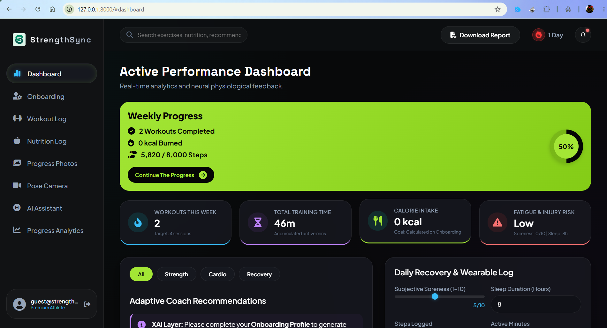
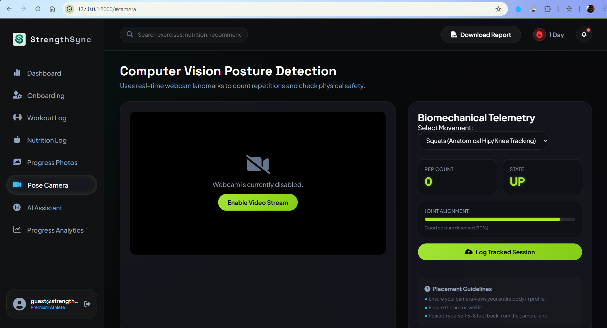

# StrengthSync — AI-Powered Personal Fitness Coach

StrengthSync is a high-performance, premium web application designed to help athletes and fitness enthusiasts track workouts, monitor physiological recovery, receive AI-customized meal recommendations, and analyze real-time body pose form tracking.

Built with an athletic dark theme featuring electric lime-green gradients, StrengthSync delivers a premium, distraction-free interface optimized for mobile and desktop screens.

---

## 📸 Application Demos

### 1. Dashboard & Progress Analytics



---

## ⚡ Key Features

* **Advanced Progress Analytics**:
  * **Acute-to-Chronic Workload Ratio (ACWR)**: Multi-day training volume tracking to monitor and prevent overtraining.
  * **Physiological Recovery Score**: Calculates daily cardiovascular stress, sleep quality, and active rest variables.
  * **Estimated 1-Rep Max Trajectory**: Visualizes progress using local ML progression curves and includes a 4-week ML projection.
* **Smart Workout Log**:
  * Large dynamic calendar day tracker.
  * Easy exercise session logging with weight load, sets, reps, and duration stats.
* **AI Diet & Meal Planner**:
  * Dynamically queries Google Gemini to generate custom macro plans based on user biometrics and training schedules.
  * Visualizes macronutrient distribution (Protein, Carbs, Fats) on an interactive Chart.js doughnut chart.
* **AI Computer Vision (Pose Detection)**:
  * Uses real-time camera tracking to analyze squat depth, push-up posture, and reps execution.

* **Local Machine Learning Estimators**:
  * Built-in Scikit-Learn pipelines to predict calories burned, target heart rate zones, and hourly hydration needs.

---

## 🛠️ Technology Stack

* **Frontend**: HTML5 (Semantic Structure), CSS3 (Modern Glassmorphism, Theme Variables), Vanilla JavaScript (ES6+), Chart.js (Interactive Data Visualizations), FontAwesome 6 (Athletic Iconography).
* **Backend**: FastAPI (Python), SQLite (Database Storage), SQLAlchemy (ORM).
* **AI & Machine Learning**: Google Gemini API (Meal & Coach Suggestions), Scikit-Learn (Calorie, Hydration, Recovery, and Zone Telemetry Models), Joblib (Model Serialization).

---

## 🚀 Getting Started

### 1. Prerequisites
* Python 3.9+
* A Google Gemini API Key (saved in `.env`)

### 2. Installation
1. Clone the repository:
   ```bash
   git clone https://github.com/AoD-X-abhi/StrengthSync-.git
   cd StrengthSync-
   ```

2. Create a virtual environment and install dependencies:
   ```bash
   python -m venv .venv
   .venv\Scripts\activate
   pip install -r requirements.txt
   ```

3. Configure your API key inside `.env`:
   ```env
   GEMINI_API_KEY=your_actual_gemini_api_key_here
   ```

4. Run the FastAPI development server:
   ```bash
   python -m uvicorn app.main:app --host 127.0.0.1 --port 8000
   ```

5. Open your browser and navigate to:
   ```
   http://127.0.0.1:8000
   ```

---

## 📁 Repository Structure

```
StrengthSync/
├── app/
│   ├── models/             # Trained Scikit-Learn ML models (.joblib)
│   ├── static/             # Frontend assets (app.js, style.css, index.html)
│   ├── database.py         # DB connection & Session config
│   ├── inference.py        # ML Model loading and prediction logic
│   ├── main.py             # FastAPI REST endpoints
│   ├── models.py           # DB Models (User, WorkoutSession, RecoveryLog)
│   └── recommendation.py   # AI coach generative prompt configs
├── data/                   # Dataset CSVs for ML training pipelines
├── demo/                   # UI demo images for the README
├── scripts/                # Data generation & ML training scripts
├── .gitignore              # Ignored files (.env, .venv, db cache)
├── requirements.txt        # Python library requirements
└── workout_app.db          # Active SQLite local database
```
